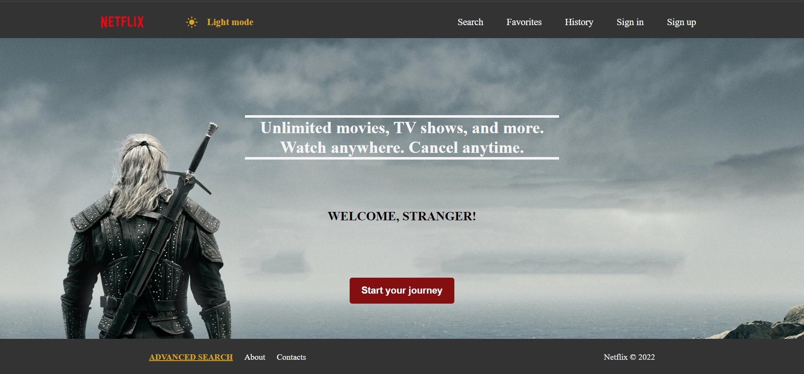

# Movie Search App

### React
- Проект написан с использованием функциональных компонентов в приоритете над классовыми.✅
- Есть четкое разделение на умные и глупые компоненты ✅ [pages](./src/pages) и [components](./src/components)
- Есть рендеринг списков ✅ [SearchResults](./src/components/SearchResults/SearchResults.tsx), [FavoritesPage](./src/pages/FavoritesPage/FavoritesPage.tsx), [HistoryPage](./src/pages/HistoryPage/HistoryPage.tsx).
- Реализована хотя бы одна форма ✅ [SignUp](./src/pages/SignUp/SignUp.tsx), [SignIn](./src/pages/SignIn/SignIn.tsx).
- Есть применение Контекст API ✅ [ThemeProvider](./src//components/ThemeProvider.tsx)
- Есть применение предохранителя ✅ [App](./src/App.tsx), [ErrorFallback](./src/components/ErrorFallback/ErrorFallback.tsx)
- Есть хотя бы один кастомный хук ✅ [hooks](./src/hooks/hooks.ts)
- Хотя бы несколько компонентов используют PropTypes ✅ [MovieCard](./src/components/MovieCard//MovieCard.tsx)
- Поиск не должен триггерить много запросов к серверу ✅ [useDebounce](./src/hooks/hooks.ts), использован в [MoviesSection](./src/pages/MoviesSection/MoviesSection.tsx).
- Есть применение lazy + Suspense ✅ [Home](./src/pages/Home/Home.tsx), [MovieSection](./src/pages/MoviesSection/MoviesSection.tsx), [SearchSection](./src/pages/SearchSection/SearchSection.tsx)

### Redux

- Используется Modern Redux with Redux Toolkit ✅ [redux](./src/redux/)
- Используются слайсы ✅ [userSlice](./src/redux/slices/userSlice.ts)
- Есть хотя бы одна кастомная мидлвара ✅ [checkLoginMiddleware](./src/middleware//checkLoginMiddleware.ts)
- Используется RTK Query ✅ [movieApi](./src/redux/api/movieApi.ts)
- Используется Transforming Responses ✅ [movieApi](./src/redux/api/movieApi.ts)

### Использован TypeScript ✅
